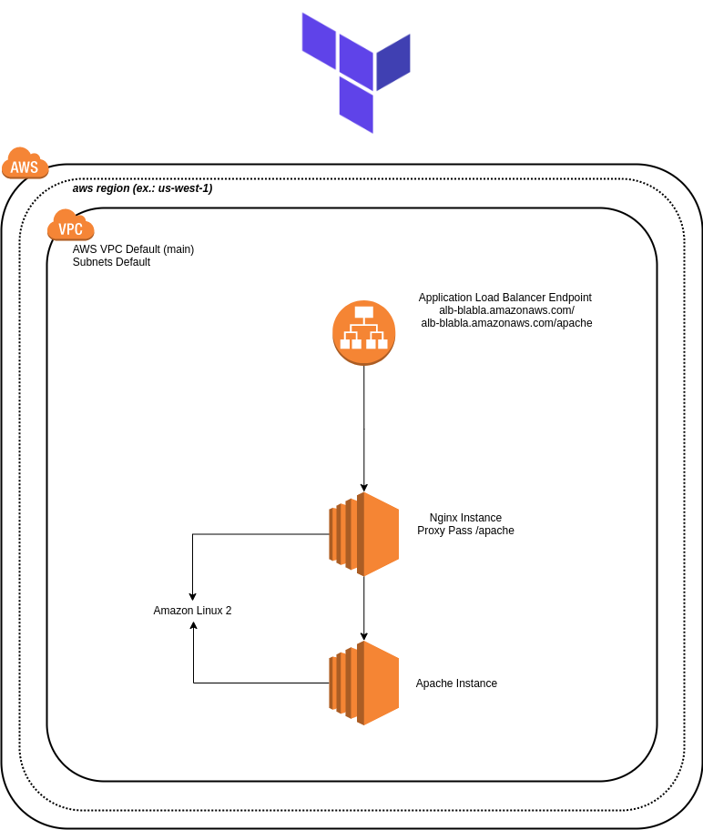

# Teste DevOps

## Testando Infraestrutura como código com Terraform 0.12.

**Criaremos via Terraform os seguintes componentes:**   

* 1x Application Load Balancer  
* 2x EC2 Server  
* Servidor 01 deverá ter Nginx instalado.  
* Servidor 02 deverá ter Apache instalado.  
* 2x security groups  
  - Para o ALB  
  - Para as instancias EC2.  

**Usamos tudo default..**  

Preferi criar o ambiente utilizando o que a AWS já disponibiliza como default. Assim, não precisamos nos preocupar em redefinir variáveis ou ajustar o ambiente para utilizar recursos customizados.      

* VPC Default
* Subnet Default
* IAM Role p/ SSM Session  

Assim, construímos a maioria dos itens do teste usando o `Data Sources` do Terraform para consultar os recursos default, citados acima, para servir de parâmetro para as construção dos recursos novos requeridos no teste.  

## AWS Region

Para ficar um teste mais genérico possível. Alterei o `main.tf` da raiz, (onde possui o provider aws e region). Aí fica a critério para você alterar apenas nesse arquivo `main.tf` a region de sua escolha.

Ficou assim:  

```bash
├── images
│   ├── diagrama-macro-v2.png
│   └── diagrama-macro-v3.png
├── 'main.tf' <- 'arquivo editado, incluindo a cláusula `data`'
├── modules
│   ├── alb.tf
│   ├── 'data.tf' <- 'incluímos esse arquivo'
│   ├── ec2.tf
│   ├── network.tf
│   ├── output.tf
│   ├── role-ssm.tf
│   ├── sg.tf
│   └── variables.tf
├── output.tf
├── README.md
```

**main.tf**  

```bash
provider "aws" {
   region = "us-west-1"
}

module "modules" {
   source = "./modules"
}
```  

**data.tf**  

```bash
data "aws_region" "current" {}
```  

**Exemplo de como ficou dentro do módulo ec2.tf**  
```bash
user_data = <<EOF
#!/bin/bash -xe
sudo yum update -y
sudo yum install -y nginx squid
sudo echo -ne $(aws ec2 describe-instances --filters "Name=tag:Name,Values=Apache" --region "${data.aws_region.current.name}"
(...)
```  

***Topologia macro de como vai ficar..***  



## Exemplos do trecho do Data Sources que utilizamos no teste    

***modules/network.tf***
```
data "aws_vpc" "default" {
   default = true
}
```  

**Estruturamos da seguinte forma..**

- Criamos as instâncias EC2 utilizando o `user_data` do terraform para instalar os pacotes necessários como:  
  * Nginx  
  * Squid
  * Apache  
  * AWS ssm Agent  

- Instalamos adicionalmente o `Squid` para que a instância do `Apache` navegue através da instância do `Nginx`. Assim evitamos de definir um `internet-gateway`, deixando o Nginx assumir um ip publico apenas para outside.  

- Na instância do `Apache` setamos algumas variáveis de ambiente para setar a instância do `Nginx` como proxy de navegação.  
  * `http_proxy="${aws_instance.nginx.private_ip}:3128"`  
  * `https_proxy="${aws_instance.nginx.private_ip}:3128"`  

- Atachamos nas instâncias ec2 do `Nginx` e `Apache` um IAM Role, (que também foi criado via terraform), com uma policy para permissão de `assumeRole` para o SSM Session.  
Isso foi necessário para restringirmos o acesso via SSH às instâncias do `Nginx` e `Apache` apenas da sessão browser via console da AWS.  
Assim, não é necessário possuir, para esse teste, o arquivo .pem para acesso às instâncias.  

- Quando criamos o `Application Load Balancer`, criamos um `Target Group` e registramos a instância do Nginx na porta 80.  
Obs.: O Listener desse `ALB` é o `Target Group` recém criado.   

- Criamos os `Security Groups` para o ALB, Nginx e Apache respectivamente, ficando:   
  * ALB: liberando tráfego do mundo na porta 80. Obs.: Outside não é verdade.   
  * Ngnix: liberando apenas a inbound da rede privada nas portas 80 e 3128 (Squid).   
  * Apache: liberando apenas a inbound da rede privada na porta 80.   

**Antes de rodar o `terraform init`, tenha em mente..**  

  - Definir o credentials aws em seu profile com access e secret key da conta `DEV` alvo dos testes.
    - Atachamos a esse usuário uma aws policy direta `AdministratorAccess`. Então, o usuário para os seus testes deverá ter essa policy diretamente atachada.   
  - Ou a utilização do aws-vault chaveando para a profile adequada para os seus testes.   

**Sequência dos comandos adotados, foram:**   

* `git clone https://github.com/147896/testes.git`    
*  `cd testes`  
* `terraform init`  
* `terraform plan`  
* `terraform apply -auto-approve`  
*  Acessar o endereço do ALB via browser. Obs.: Esse endereço foi retornado pelo output do terraform.  
  -  ALB-blabla01.us-west-1.elb.amazonaws.com ***# para acessar o Nginx***  
  -  ALB-blabla01.us-west-1.elb.amazonaws.com/apache ***# para acessar o Apache***   

**Os arquivos, tree..**

***distribuímos os arquivos e módulos terraform conforme a árvore abaixo:***   
```bash
├── images
│   ├── diagrama-macro-v2.png
│   └── diagrama-macro-v3.png
├── main.tf
├── modules
│   ├── alb.tf
│   ├── data.tf
│   ├── ec2.tf
│   ├── network.tf
│   ├── output.tf
│   ├── role-ssm.tf
│   ├── sg.tf
│   └── variables.tf
├── output.tf
├── README.md  
```  

**Quando executei.. Tipo, na minha máquina funciona..** :laughing:  

***Exemplos***  

Não mantive o arquivo do terraform.tfstate no repo. Então, fica obrigado a executar o `terraform init` na raiz do diretório ***testes***.  

***Clonando o repo..***  
```bash
~$ git clone https://github.com/147896/testes
Cloning into 'testes'...
remote: Enumerating objects: 73, done.
remote: Counting objects: 100% (73/73), done.
remote: Compressing objects: 100% (45/45), done.
remote: Total 73 (delta 25), reused 65 (delta 20), pack-reused 0
Unpacking objects: 100% (73/73), done.  
```  

***Entrando no diretório..***  
```bash
~$ cd testes/
```  

***Executando o terraform init..***  
```bash
~$ terraform init
Initializing modules...
- modules in modules

Initializing the backend...

Initializing provider plugins...
- Checking for available provider plugins...
- Downloading plugin for provider "aws" (hashicorp/aws) 2.69.0...

The following providers do not have any version constraints in configuration,
so the latest version was installed.

To prevent automatic upgrades to new major versions that may contain breaking
changes, it is recommended to add version = "..." constraints to the
corresponding provider blocks in configuration, with the constraint strings
suggested below.

* provider.aws: version = "~> 2.69"

Terraform has been successfully initialized!

You may now begin working with Terraform. Try running "terraform plan" to see
any changes that are required for your infrastructure. All Terraform commands
should now work.

If you ever set or change modules or backend configuration for Terraform,
rerun this command to reinitialize your working directory. If you forget, other
commands will detect it and remind you to do so if necessary.
```  

***Executando o terraform plan***  
```bash
~$ terraform plan
Refreshing Terraform state in-memory prior to plan...
The refreshed state will be used to calculate this plan, but will not be
persisted to local or remote state storage.

module.modules.data.aws_vpc.default: Refreshing state...
module.modules.data.aws_subnet_ids.selected: Refreshing state...
module.modules.data.aws_subnet.selected[1]: Refreshing state...
module.modules.data.aws_subnet.selected[2]: Refreshing state...
module.modules.data.aws_subnet.selected[4]: Refreshing state...
module.modules.data.aws_subnet.selected[0]: Refreshing state...
module.modules.data.aws_subnet.selected[3]: Refreshing state...
module.modules.data.aws_subnet.selected[5]: Refreshing state...

------------------------------------------------------------------------

An execution plan has been generated and is shown below.
Resource actions are indicated with the following symbols:
  + create

Terraform will perform the following actions:

  # module.modules.aws_alb.lb will be created
  + resource "aws_alb" "lb" {
      + arn                        = (known after apply)
      + arn_suffix                 = (known after apply)
      + dns_name                   = (known after apply)
      + drop_invalid_header_fields = false
      + enable_deletion_protection = false
      + enable_http2               = true
      + id                         = (known after apply)
      + idle_timeout               = 60
      + internal                   = (known after apply)
      + ip_address_type            = (known after apply)
      + load_balancer_type         = "application"
      + name                       = "ALB"
      + security_groups            = (known after apply)
      + subnets                    = [
          + "subnet-3c2bfa5a",
          + "subnet-57b66b08",
        ]
      + tags                       = {
          + "Name" = "ALB"
        }
      + vpc_id                     = (known after apply)
      + zone_id                    = (known after apply)

      + subnet_mapping {
          + allocation_id = (known after apply)
          + subnet_id     = (known after apply)
        }
    }

  # module.modules.aws_iam_instance_profile.ssm_instance_profile will be created
  + resource "aws_iam_instance_profile" "ssm_instance_profile" {
      + arn         = (known after apply)
      + create_date = (known after apply)
      + id          = (known after apply)
      + name        = "ssm_instance_profile"
      + path        = "/"
      + role        = "ssm_role_instance"
      + roles       = (known after apply)
      + unique_id   = (known after apply)
    }

  # module.modules.aws_iam_role.role will be created
  + resource "aws_iam_role" "role" {
      + arn                   = (known after apply)
      + assume_role_policy    = jsonencode(
            {
              + Statement = [
                  + {
                      + Action    = "sts:AssumeRole"
                      + Effect    = "Allow"
                      + Principal = {
                          + Service = [
                              + "ec2.amazonaws.com",
                            ]
                        }
                      + Sid       = ""
                    },
                ]
              + Version   = "2012-10-17"
            }
        )
      + create_date           = (known after apply)
      + force_detach_policies = false
      + id                    = (known after apply)
      + max_session_duration  = 3600
      + name                  = "ssm_role_instance"
      + path                  = "/"
      + unique_id             = (known after apply)
    }

  # module.modules.aws_iam_role_policy.test_ssm_policy will be created
  + resource "aws_iam_role_policy" "test_ssm_policy" {
      + id     = (known after apply)
      + name   = "test_ssm_policy"
      + policy = jsonencode(
            {
              + Statement = [
                  + {
                      + Action   = [
                          + "cloudwatch:PutMetricData",
                          + "ds:CreateComputer",
                          + "ds:DescribeDirectories",
                          + "ec2:DescribeInstanceStatus",
                          + "ec2:DescribeInstances",
                          + "logs:*",
                          + "ssm:*",
                          + "ec2messages:*",
                        ]
                      + Effect   = "Allow"
                      + Resource = "*"
                    },
                  + {
                      + Action    = "iam:CreateServiceLinkedRole"
                      + Condition = {
                          + StringLike = {
                              + iam:AWSServiceName = "ssm.amazonaws.com"
                            }
                        }
                      + Effect    = "Allow"
                      + Resource  = "arn:aws:iam::*:role/aws-service-role/ssm.amazonaws.com/AWSServiceRoleForAmazonSSM*"
                    },
                  + {
                      + Action   = [
                          + "iam:DeleteServiceLinkedRole",
                          + "iam:GetServiceLinkedRoleDeletionStatus",
                        ]
                      + Effect   = "Allow"
                      + Resource = "arn:aws:iam::*:role/aws-service-role/ssm.amazonaws.com/AWSServiceRoleForAmazonSSM*"
                    },
                  + {
                      + Action   = [
                          + "ssmmessages:CreateControlChannel",
                          + "ssmmessages:CreateDataChannel",
                          + "ssmmessages:OpenControlChannel",
                          + "ssmmessages:OpenDataChannel",
                        ]
                      + Effect   = "Allow"
                      + Resource = "*"
                    },
                ]
              + Version   = "2012-10-17"
            }
        )
      + role   = (known after apply)
    }

  # module.modules.aws_instance.apache will be created
  + resource "aws_instance" "apache" {
      + ami                          = "ami-0e9089763828757e1"
      + arn                          = (known after apply)
      + associate_public_ip_address  = false
      + availability_zone            = (known after apply)
      + cpu_core_count               = (known after apply)
      + cpu_threads_per_core         = (known after apply)
      + get_password_data            = false
      + host_id                      = (known after apply)
      + iam_instance_profile         = "ssm_instance_profile"
      + id                           = (known after apply)
      + instance_state               = (known after apply)
      + instance_type                = "t2.micro"
      + ipv6_address_count           = (known after apply)
      + ipv6_addresses               = (known after apply)
      + key_name                     = "apache"
      + network_interface_id         = (known after apply)
      + outpost_arn                  = (known after apply)
      + password_data                = (known after apply)
      + placement_group              = (known after apply)
      + primary_network_interface_id = (known after apply)
      + private_dns                  = (known after apply)
      + private_ip                   = (known after apply)
      + public_dns                   = (known after apply)
      + public_ip                    = (known after apply)
      + security_groups              = (known after apply)
      + source_dest_check            = true
      + subnet_id                    = "subnet-3c2bfa5a"
      + tags                         = {
          + "Hostname" = "apache"
          + "Name"     = "Apache"
        }
      + tenancy                      = (known after apply)
      + user_data                    = (known after apply)
      + volume_tags                  = (known after apply)
      + vpc_security_group_ids       = (known after apply)

      + ebs_block_device {
          + delete_on_termination = (known after apply)
          + device_name           = (known after apply)
          + encrypted             = (known after apply)
          + iops                  = (known after apply)
          + kms_key_id            = (known after apply)
          + snapshot_id           = (known after apply)
          + volume_id             = (known after apply)
          + volume_size           = (known after apply)
          + volume_type           = (known after apply)
        }

      + ephemeral_block_device {
          + device_name  = (known after apply)
          + no_device    = (known after apply)
          + virtual_name = (known after apply)
        }

      + metadata_options {
          + http_endpoint               = (known after apply)
          + http_put_response_hop_limit = (known after apply)
          + http_tokens                 = (known after apply)
        }

      + network_interface {
          + delete_on_termination = (known after apply)
          + device_index          = (known after apply)
          + network_interface_id  = (known after apply)
        }

      + root_block_device {
          + delete_on_termination = (known after apply)
          + device_name           = (known after apply)
          + encrypted             = (known after apply)
          + iops                  = (known after apply)
          + kms_key_id            = (known after apply)
          + volume_id             = (known after apply)
          + volume_size           = (known after apply)
          + volume_type           = (known after apply)
        }
    }

  # module.modules.aws_instance.nginx will be created
  + resource "aws_instance" "nginx" {
      + ami                          = "ami-0e9089763828757e1"
      + arn                          = (known after apply)
      + associate_public_ip_address  = true
      + availability_zone            = (known after apply)
      + cpu_core_count               = (known after apply)
      + cpu_threads_per_core         = (known after apply)
      + get_password_data            = false
      + host_id                      = (known after apply)
      + iam_instance_profile         = "ssm_instance_profile"
      + id                           = (known after apply)
      + instance_state               = (known after apply)
      + instance_type                = "t2.micro"
      + ipv6_address_count           = (known after apply)
      + ipv6_addresses               = (known after apply)
      + key_name                     = "nginx"
      + network_interface_id         = (known after apply)
      + outpost_arn                  = (known after apply)
      + password_data                = (known after apply)
      + placement_group              = (known after apply)
      + primary_network_interface_id = (known after apply)
      + private_dns                  = (known after apply)
      + private_ip                   = (known after apply)
      + public_dns                   = (known after apply)
      + public_ip                    = (known after apply)
      + security_groups              = (known after apply)
      + source_dest_check            = true
      + subnet_id                    = "subnet-3c2bfa5a"
      + tags                         = {
          + "Hostname" = "nginx"
          + "Name"     = "Nginx"
        }
      + tenancy                      = (known after apply)
      + user_data                    = "2410a1ce036208f470942390d6febefc78ebe162"
      + volume_tags                  = (known after apply)
      + vpc_security_group_ids       = (known after apply)

      + ebs_block_device {
          + delete_on_termination = (known after apply)
          + device_name           = (known after apply)
          + encrypted             = (known after apply)
          + iops                  = (known after apply)
          + kms_key_id            = (known after apply)
          + snapshot_id           = (known after apply)
          + volume_id             = (known after apply)
          + volume_size           = (known after apply)
          + volume_type           = (known after apply)
        }

      + ephemeral_block_device {
          + device_name  = (known after apply)
          + no_device    = (known after apply)
          + virtual_name = (known after apply)
        }

      + metadata_options {
          + http_endpoint               = (known after apply)
          + http_put_response_hop_limit = (known after apply)
          + http_tokens                 = (known after apply)
        }

      + network_interface {
          + delete_on_termination = (known after apply)
          + device_index          = (known after apply)
          + network_interface_id  = (known after apply)
        }

      + root_block_device {
          + delete_on_termination = (known after apply)
          + device_name           = (known after apply)
          + encrypted             = (known after apply)
          + iops                  = (known after apply)
          + kms_key_id            = (known after apply)
          + volume_id             = (known after apply)
          + volume_size           = (known after apply)
          + volume_type           = (known after apply)
        }
    }

  # module.modules.aws_lb_listener.lbl will be created
  + resource "aws_lb_listener" "lbl" {
      + arn               = (known after apply)
      + id                = (known after apply)
      + load_balancer_arn = (known after apply)
      + port              = 80
      + protocol          = "HTTP"
      + ssl_policy        = (known after apply)

      + default_action {
          + order            = (known after apply)
          + target_group_arn = (known after apply)
          + type             = "forward"
        }
    }

  # module.modules.aws_lb_listener_rule.tg will be created
  + resource "aws_lb_listener_rule" "tg" {
      + arn          = (known after apply)
      + id           = (known after apply)
      + listener_arn = (known after apply)
      + priority     = 5

      + action {
          + order            = (known after apply)
          + target_group_arn = (known after apply)
          + type             = "forward"
        }

      + condition {
          + field  = (known after apply)
          + values = (known after apply)

          + host_header {
              + values = (known after apply)
            }

          + path_pattern {
              + values = [
                  + "/apache*",
                ]
            }
        }
    }

  # module.modules.aws_lb_target_group.tg will be created
  + resource "aws_lb_target_group" "tg" {
      + arn                                = (known after apply)
      + arn_suffix                         = (known after apply)
      + deregistration_delay               = 300
      + id                                 = (known after apply)
      + lambda_multi_value_headers_enabled = false
      + load_balancing_algorithm_type      = (known after apply)
      + name                               = "ALB-TG"
      + port                               = 80
      + protocol                           = "HTTP"
      + proxy_protocol_v2                  = false
      + slow_start                         = 0
      + target_type                        = "instance"
      + vpc_id                             = "vpc-0516fb78"

      + health_check {
          + enabled             = (known after apply)
          + healthy_threshold   = (known after apply)
          + interval            = (known after apply)
          + matcher             = (known after apply)
          + path                = (known after apply)
          + port                = (known after apply)
          + protocol            = (known after apply)
          + timeout             = (known after apply)
          + unhealthy_threshold = (known after apply)
        }

      + stickiness {
          + cookie_duration = (known after apply)
          + enabled         = (known after apply)
          + type            = (known after apply)
        }
    }

  # module.modules.aws_lb_target_group_attachment.tg_nginx will be created
  + resource "aws_lb_target_group_attachment" "tg_nginx" {
      + id               = (known after apply)
      + port             = 80
      + target_group_arn = (known after apply)
      + target_id        = (known after apply)
    }

  # module.modules.aws_security_group.sg_alb will be created
  + resource "aws_security_group" "sg_alb" {
      + arn                    = (known after apply)
      + description            = "SG alb"
      + egress                 = [
          + {
              + cidr_blocks      = [
                  + "0.0.0.0/0",
                ]
              + description      = ""
              + from_port        = 0
              + ipv6_cidr_blocks = []
              + prefix_list_ids  = []
              + protocol         = "-1"
              + security_groups  = []
              + self             = false
              + to_port          = 0
            },
        ]
      + id                     = (known after apply)
      + ingress                = [
          + {
              + cidr_blocks      = [
                  + "0.0.0.0/0",
                ]
              + description      = "Allow HTTP traffic incoming from world to ALB"
              + from_port        = 80
              + ipv6_cidr_blocks = []
              + prefix_list_ids  = []
              + protocol         = "tcp"
              + security_groups  = []
              + self             = false
              + to_port          = 80
            },
        ]
      + name                   = "sg alb"
      + owner_id               = (known after apply)
      + revoke_rules_on_delete = false
      + tags                   = {
          + "Name" = "ALB"
        }
      + vpc_id                 = "vpc-0516fb78"
    }

  # module.modules.aws_security_group.sg_apache will be created
  + resource "aws_security_group" "sg_apache" {
      + arn                    = (known after apply)
      + description            = "SG Apache"
      + egress                 = [
          + {
              + cidr_blocks      = [
                  + "0.0.0.0/0",
                ]
              + description      = ""
              + from_port        = 0
              + ipv6_cidr_blocks = []
              + prefix_list_ids  = []
              + protocol         = "-1"
              + security_groups  = []
              + self             = false
              + to_port          = 0
            },
        ]
      + id                     = (known after apply)
      + ingress                = [
          + {
              + cidr_blocks      = [
                  + "0.0.0.0/0",
                ]
              + description      = "Allow SSH traffic"
              + from_port        = 22
              + ipv6_cidr_blocks = []
              + prefix_list_ids  = []
              + protocol         = "tcp"
              + security_groups  = []
              + self             = false
              + to_port          = 22
            },
          + {
              + cidr_blocks      = [
                  + "172.31.0.0/16",
                ]
              + description      = "Allow HTTP traffic incoming from Nginx"
              + from_port        = 80
              + ipv6_cidr_blocks = []
              + prefix_list_ids  = []
              + protocol         = "tcp"
              + security_groups  = []
              + self             = false
              + to_port          = 80
            },
        ]
      + name                   = "sg apache"
      + owner_id               = (known after apply)
      + revoke_rules_on_delete = false
      + tags                   = {
          + "Name" = "Apache"
        }
      + vpc_id                 = "vpc-0516fb78"
    }

  # module.modules.aws_security_group.sg_nginx will be created
  + resource "aws_security_group" "sg_nginx" {
      + arn                    = (known after apply)
      + description            = "SG Nginx"
      + egress                 = [
          + {
              + cidr_blocks      = [
                  + "0.0.0.0/0",
                ]
              + description      = ""
              + from_port        = 0
              + ipv6_cidr_blocks = []
              + prefix_list_ids  = []
              + protocol         = "-1"
              + security_groups  = []
              + self             = false
              + to_port          = 0
            },
        ]
      + id                     = (known after apply)
      + ingress                = [
          + {
              + cidr_blocks      = [
                  + "0.0.0.0/0",
                ]
              + description      = "Allow SSH traffic"
              + from_port        = 22
              + ipv6_cidr_blocks = []
              + prefix_list_ids  = []
              + protocol         = "tcp"
              + security_groups  = []
              + self             = false
              + to_port          = 22
            },
          + {
              + cidr_blocks      = [
                  + "172.31.0.0/16",
                ]
              + description      = "Allow HTTP traffic incoming from ALB to nginx"
              + from_port        = 80
              + ipv6_cidr_blocks = []
              + prefix_list_ids  = []
              + protocol         = "tcp"
              + security_groups  = []
              + self             = false
              + to_port          = 80
            },
          + {
              + cidr_blocks      = [
                  + "172.31.0.0/16",
                ]
              + description      = "Allow incoming Apache instance to squid port"
              + from_port        = 3128
              + ipv6_cidr_blocks = []
              + prefix_list_ids  = []
              + protocol         = "tcp"
              + security_groups  = []
              + self             = false
              + to_port          = 3128
            },
        ]
      + name                   = "sg nginx"
      + owner_id               = (known after apply)
      + revoke_rules_on_delete = false
      + tags                   = {
          + "Name" = "Nginx"
        }
      + vpc_id                 = "vpc-0516fb78"
    }

Plan: 13 to add, 0 to change, 0 to destroy.

------------------------------------------------------------------------

Note: You didn't specify an "-out" parameter to save this plan, so Terraform
can't guarantee that exactly these actions will be performed if
"terraform apply" is subsequently run.
```  

***Executando o terraform apply -auto-approve***  
```bash
~$ terraform apply -auto-approve
module.modules.data.aws_vpc.default: Refreshing state...
module.modules.data.aws_subnet_ids.selected: Refreshing state...
module.modules.data.aws_subnet.selected[0]: Refreshing state...
module.modules.data.aws_subnet.selected[3]: Refreshing state...
module.modules.data.aws_subnet.selected[2]: Refreshing state...
module.modules.data.aws_subnet.selected[4]: Refreshing state...
module.modules.data.aws_subnet.selected[5]: Refreshing state...
module.modules.data.aws_subnet.selected[1]: Refreshing state...
module.modules.aws_iam_role.role: Creating...
module.modules.aws_lb_target_group.tg: Creating...
module.modules.aws_security_group.sg_alb: Creating...
module.modules.aws_security_group.sg_apache: Creating...
module.modules.aws_security_group.sg_nginx: Creating...
module.modules.aws_iam_role.role: Creation complete after 1s [id=ssm_role_instance]
module.modules.aws_iam_role_policy.test_ssm_policy: Creating...
module.modules.aws_iam_instance_profile.ssm_instance_profile: Creating...
module.modules.aws_iam_role_policy.test_ssm_policy: Creation complete after 1s [id=ssm_role_instance:test_ssm_policy]
module.modules.aws_iam_instance_profile.ssm_instance_profile: Creation complete after 2s [id=ssm_instance_profile]
module.modules.aws_lb_target_group.tg: Creation complete after 3s [id=arn:aws:elasticloadbalancing:us-west-1:065594493678:targetgroup/ALB-TG/f566ce86c5ac142e]
module.modules.aws_security_group.sg_apache: Creation complete after 6s [id=sg-0f0c5de97571e18a8]
module.modules.aws_security_group.sg_alb: Creation complete after 7s [id=sg-045515ece335b8a3a]
module.modules.aws_alb.lb: Creating...
module.modules.aws_security_group.sg_nginx: Creation complete after 7s [id=sg-05d684ec3c0301249]
module.modules.aws_instance.nginx: Creating...
module.modules.aws_alb.lb: Still creating... [10s elapsed]
module.modules.aws_instance.nginx: Still creating... [10s elapsed]
module.modules.aws_alb.lb: Still creating... [20s elapsed]
module.modules.aws_instance.nginx: Still creating... [20s elapsed]
module.modules.aws_instance.nginx: Creation complete after 29s [id=i-0860908352cd73137]
module.modules.aws_lb_target_group_attachment.tg_nginx: Creating...
module.modules.aws_instance.apache: Creating...
module.modules.aws_alb.lb: Still creating... [30s elapsed]
module.modules.aws_lb_target_group_attachment.tg_nginx: Creation complete after 0s [id=arn:aws:elasticloadbalancing:us-west-1:065594493678:targetgroup/ALB-TG/f566ce86c5ac142e-20200706145934210300000001]
module.modules.aws_instance.apache: Still creating... [10s elapsed]
module.modules.aws_alb.lb: Still creating... [40s elapsed]
module.modules.aws_instance.apache: Still creating... [20s elapsed]
module.modules.aws_alb.lb: Still creating... [50s elapsed]
module.modules.aws_instance.apache: Creation complete after 28s [id=i-0b015d85173706f9a]
module.modules.aws_alb.lb: Still creating... [1m0s elapsed]
module.modules.aws_alb.lb: Still creating... [1m10s elapsed]
module.modules.aws_alb.lb: Still creating... [1m20s elapsed]
module.modules.aws_alb.lb: Still creating... [1m30s elapsed]
module.modules.aws_alb.lb: Still creating... [1m40s elapsed]
module.modules.aws_alb.lb: Still creating... [1m50s elapsed]
module.modules.aws_alb.lb: Still creating... [2m0s elapsed]
module.modules.aws_alb.lb: Still creating... [2m10s elapsed]
module.modules.aws_alb.lb: Still creating... [2m20s elapsed]
module.modules.aws_alb.lb: Still creating... [2m30s elapsed]
module.modules.aws_alb.lb: Still creating... [2m40s elapsed]
module.modules.aws_alb.lb: Still creating... [2m50s elapsed]
module.modules.aws_alb.lb: Still creating... [3m0s elapsed]
module.modules.aws_alb.lb: Still creating... [3m10s elapsed]
module.modules.aws_alb.lb: Still creating... [3m20s elapsed]
module.modules.aws_alb.lb: Still creating... [3m30s elapsed]
module.modules.aws_alb.lb: Still creating... [3m40s elapsed]
module.modules.aws_alb.lb: Creation complete after 3m46s [id=arn:aws:elasticloadbalancing:us-west-1:065594493678:loadbalancer/app/ALB/fba1157e0f8fc575]
module.modules.aws_lb_listener.lbl: Creating...
module.modules.aws_lb_listener.lbl: Creation complete after 1s [id=arn:aws:elasticloadbalancing:us-west-1:065594493678:listener/app/ALB/fba1157e0f8fc575/96e7b4dea5c029d8]
module.modules.aws_lb_listener_rule.tg: Creating...
module.modules.aws_lb_listener_rule.tg: Creation complete after 1s [id=arn:aws:elasticloadbalancing:us-west-1:065594493678:listener-rule/app/ALB/fba1157e0f8fc575/96e7b4dea5c029d8/88ee3b71e6d3443f]

Apply complete! Resources: 13 added, 0 changed, 0 destroyed.

Outputs:

alb_address = ALB-281288455.us-west-1.elb.amazonaws.com
```  

***Vamos acessar o endereço do ALB que mostrou no Outputs acima com `curl`***  
```bash
~$ curl ALB-281288455.us-west-1.elb.amazonaws.com
<h1>Hello Nginx - DevOps Tests</h1>
```
Como você pode ver acima retornou a página que escrevemos no index.html do Nginx.  

***Vamos acessar o endereço do mesmo ALB acima adicionando o contexto do apache também utilizando `curl`***  
```bash
~$ curl ALB-281288455.us-west-1.elb.amazonaws.com/apache/
<h1>Hello Apache - DevOps Tests</h1>
```  
No exemplo acima acessamos a página do apache que está atrás do Nginx. O Nginx fez o papel de Proxy Reverso nesse caso.  

***Agora, vamos destruir tudo. Afinal, não queremos ser cobrados no futuro..*** :wink:
```bash
~$ terraform destroy -auto-approve
module.modules.data.aws_vpc.default: Refreshing state...
module.modules.aws_iam_role.role: Refreshing state... [id=ssm_role_instance]
module.modules.aws_iam_instance_profile.ssm_instance_profile: Refreshing state... [id=ssm_instance_profile]
module.modules.aws_iam_role_policy.test_ssm_policy: Refreshing state... [id=ssm_role_instance:test_ssm_policy]
module.modules.aws_lb_target_group.tg: Refreshing state... [id=arn:aws:elasticloadbalancing:us-west-1:065594493678:targetgroup/ALB-TG/f566ce86c5ac142e]
module.modules.data.aws_subnet_ids.selected: Refreshing state...
module.modules.aws_security_group.sg_alb: Refreshing state... [id=sg-045515ece335b8a3a]
module.modules.aws_security_group.sg_apache: Refreshing state... [id=sg-0f0c5de97571e18a8]
module.modules.aws_security_group.sg_nginx: Refreshing state... [id=sg-05d684ec3c0301249]
module.modules.data.aws_subnet.selected[2]: Refreshing state...
module.modules.data.aws_subnet.selected[0]: Refreshing state...
module.modules.data.aws_subnet.selected[5]: Refreshing state...
module.modules.data.aws_subnet.selected[3]: Refreshing state...
module.modules.data.aws_subnet.selected[4]: Refreshing state...
module.modules.data.aws_subnet.selected[1]: Refreshing state...
module.modules.aws_instance.nginx: Refreshing state... [id=i-0860908352cd73137]
module.modules.aws_alb.lb: Refreshing state... [id=arn:aws:elasticloadbalancing:us-west-1:065594493678:loadbalancer/app/ALB/fba1157e0f8fc575]
module.modules.aws_lb_listener.lbl: Refreshing state... [id=arn:aws:elasticloadbalancing:us-west-1:065594493678:listener/app/ALB/fba1157e0f8fc575/96e7b4dea5c029d8]
module.modules.aws_lb_listener_rule.tg: Refreshing state... [id=arn:aws:elasticloadbalancing:us-west-1:065594493678:listener-rule/app/ALB/fba1157e0f8fc575/96e7b4dea5c029d8/88ee3b71e6d3443f]
module.modules.aws_lb_target_group_attachment.tg_nginx: Refreshing state... [id=arn:aws:elasticloadbalancing:us-west-1:065594493678:targetgroup/ALB-TG/f566ce86c5ac142e-20200706145934210300000001]
module.modules.aws_instance.apache: Refreshing state... [id=i-0b015d85173706f9a]
module.modules.aws_instance.apache: Destroying... [id=i-0b015d85173706f9a]
module.modules.aws_iam_role_policy.test_ssm_policy: Destroying... [id=ssm_role_instance:test_ssm_policy]
module.modules.aws_lb_listener_rule.tg: Destroying... [id=arn:aws:elasticloadbalancing:us-west-1:065594493678:listener-rule/app/ALB/fba1157e0f8fc575/96e7b4dea5c029d8/88ee3b71e6d3443f]
module.modules.aws_lb_target_group_attachment.tg_nginx: Destroying... [id=arn:aws:elasticloadbalancing:us-west-1:065594493678:targetgroup/ALB-TG/f566ce86c5ac142e-20200706145934210300000001]
module.modules.aws_lb_listener_rule.tg: Destruction complete after 1s
module.modules.aws_iam_role_policy.test_ssm_policy: Destruction complete after 1s
module.modules.aws_lb_target_group_attachment.tg_nginx: Destruction complete after 1s
module.modules.aws_lb_listener.lbl: Destroying... [id=arn:aws:elasticloadbalancing:us-west-1:065594493678:listener/app/ALB/fba1157e0f8fc575/96e7b4dea5c029d8]
module.modules.aws_lb_listener.lbl: Destruction complete after 1s
module.modules.aws_alb.lb: Destroying... [id=arn:aws:elasticloadbalancing:us-west-1:065594493678:loadbalancer/app/ALB/fba1157e0f8fc575]
module.modules.aws_lb_target_group.tg: Destroying... [id=arn:aws:elasticloadbalancing:us-west-1:065594493678:targetgroup/ALB-TG/f566ce86c5ac142e]
module.modules.aws_lb_target_group.tg: Destruction complete after 0s
module.modules.aws_alb.lb: Destruction complete after 3s
module.modules.aws_security_group.sg_alb: Destroying... [id=sg-045515ece335b8a3a]
module.modules.aws_instance.apache: Still destroying... [id=i-0b015d85173706f9a, 10s elapsed]
module.modules.aws_security_group.sg_alb: Still destroying... [id=sg-045515ece335b8a3a, 10s elapsed]
module.modules.aws_instance.apache: Still destroying... [id=i-0b015d85173706f9a, 20s elapsed]
module.modules.aws_security_group.sg_alb: Still destroying... [id=sg-045515ece335b8a3a, 20s elapsed]
module.modules.aws_security_group.sg_alb: Destruction complete after 21s
module.modules.aws_instance.apache: Still destroying... [id=i-0b015d85173706f9a, 30s elapsed]
module.modules.aws_instance.apache: Destruction complete after 33s
module.modules.aws_security_group.sg_apache: Destroying... [id=sg-0f0c5de97571e18a8]
module.modules.aws_instance.nginx: Destroying... [id=i-0860908352cd73137]
module.modules.aws_security_group.sg_apache: Destruction complete after 1s
module.modules.aws_instance.nginx: Still destroying... [id=i-0860908352cd73137, 10s elapsed]
module.modules.aws_instance.nginx: Still destroying... [id=i-0860908352cd73137, 20s elapsed]
module.modules.aws_instance.nginx: Still destroying... [id=i-0860908352cd73137, 30s elapsed]
module.modules.aws_instance.nginx: Still destroying... [id=i-0860908352cd73137, 40s elapsed]
module.modules.aws_instance.nginx: Still destroying... [id=i-0860908352cd73137, 50s elapsed]
module.modules.aws_instance.nginx: Still destroying... [id=i-0860908352cd73137, 1m0s elapsed]
module.modules.aws_instance.nginx: Destruction complete after 1m4s
module.modules.aws_iam_instance_profile.ssm_instance_profile: Destroying... [id=ssm_instance_profile]
module.modules.aws_security_group.sg_nginx: Destroying... [id=sg-05d684ec3c0301249]
module.modules.aws_iam_instance_profile.ssm_instance_profile: Destruction complete after 2s
module.modules.aws_iam_role.role: Destroying... [id=ssm_role_instance]
module.modules.aws_security_group.sg_nginx: Destruction complete after 2s
module.modules.aws_iam_role.role: Destruction complete after 1s

Destroy complete! Resources: 13 destroyed.
```  


***Adicionalmente..***  

Não atribuí um `key_name` nas instâncias ec2 (Nginx e Apache) para você não ter que criar um `key pair` para as instâncias.  
Porém, caso você precise conectar via SSH nas instâncias. Você pode utilizar o `AWS Session Manager` ou criar um `key pairs` para elas.  
No entanto, lembre-se de adicionar a `key_name` no arquivo terraform `ec2.tf` em `modules`.  

**Referências**  
https://www.terraform.io/docs/providers/aws/  
https://docs.aws.amazon.com/systems-manager/latest/userguide/session-manager-working-with-install-plugin.html  


